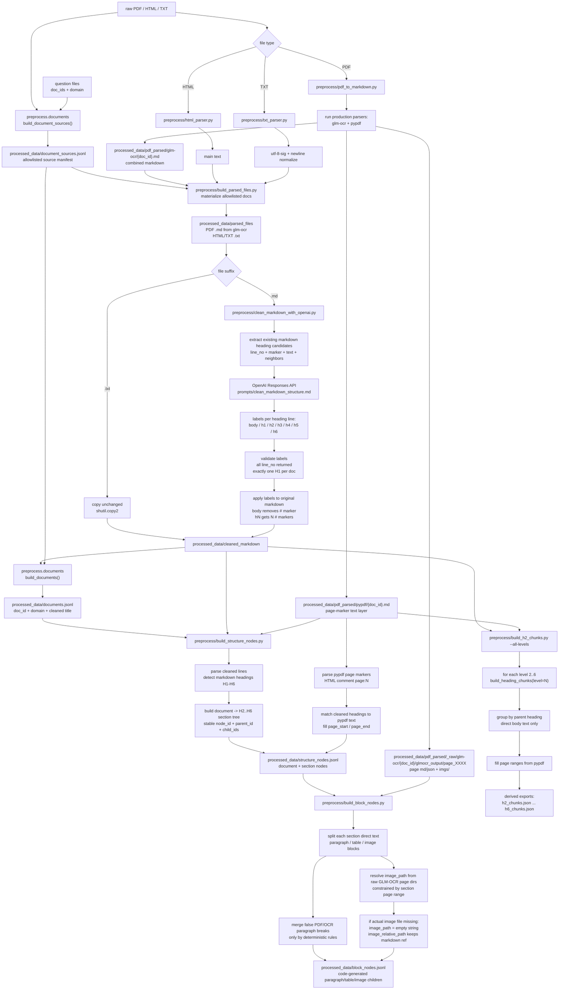

# Header-Based Production Preprocess Flowchart

Scope: current `preprocess/` production flow. The old PDF parsing code is only
used as the upstream OCR/text-layer producer (`glm-ocr` and `pypdf`). The latest
canonical structure is code-generated as `structure_nodes.jsonl` and
`block_nodes.jsonl`; H2-H6 files remain derived compatibility/debug exports.

Key distinction: `structure_nodes.jsonl` is the canonical document/section tree.
`block_nodes.jsonl` is generated by repository code from that tree and raw parser
artifacts; paragraph/table/image nodes are not hand-authored. Image nodes only
use `image_path` for real files under
`processed_data/pdf_parsed/_raw/glm-ocr/{doc_id}/glmocr_output/page_XXXX/imgs/`.
If the file is absent, `image_path` is empty and the original markdown reference
stays in `image_relative_path`.
